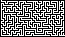
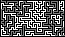

# Image-Maze-Generator-CPP
Maze generation in C++, using <u>Recursive Backtracker</u> (<u>Depth-first Search</u>).  Input `width`, `height`, `file name`, and whether or not you wish to generate the `solution`, and out pops a `.bmp` (or two) with each pixel as a maze cell.

<strong>`.bmp` formatted files are easily printable, as well as digitally viewable.</strong>

> Orignal size  |  5X size
 

> Solution for first example
---

> ~If you input a width, height, and filename but <strong>no maze is generated</strong>, try using <strong>smaller width and height</strong>. It's probably something to do with cpp arrays.~
